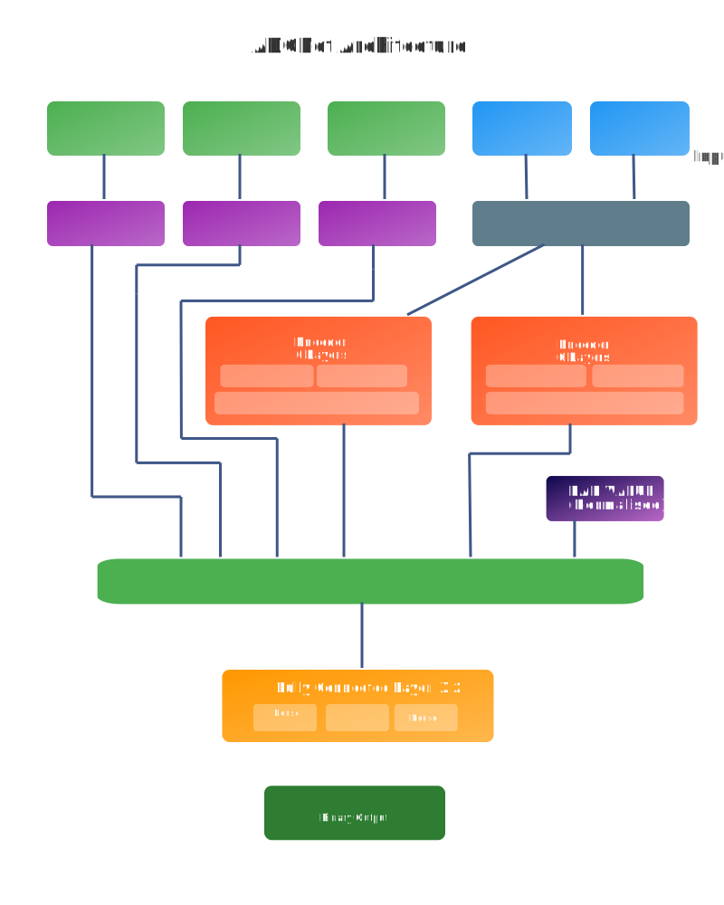

# ADCNet
Semi-supervised learning for ADC property prediction - **PyTorch Implementation**



## Project Overview

This repository contains our **successful replication** of the ADCNet model designed by the original authors. We have converted the entire architecture from TensorFlow to PyTorch framework, achieving superior performance compared to the original implementation.

### Key Achievements

- **Framework Migration**: Successfully converted the complete ADCNet architecture from TensorFlow to PyTorch
- **Weight Conversion**: Performed complex weight conversion from TensorFlow .h5 format to PyTorch .pth format for the FG-BERT encoder
- **Performance Improvement**: Achieved **89% test accuracy** (+2% improvement over the original 87% reported by authors)
- **Hyperparameter Consistency**: Trained using identical hyperparameters as the original authors to ensure fair comparison

## Deep Technical Implementation

### FG-BERT Encoder Conversion Challenge
FG-BERT (Functional Group-BERT) is a self-supervised deep learning framework designed to enhance molecular representation learning by focusing on functional groups within molecules. Developed by idrugLab, FG-BERT leverages the Transformer architecture to pretrain on approximately 1.45 million unlabeled drug-like molecules, enabling the model to learn meaningful representations by masking and predicting functional groups, trained on 44 benchmark datasets
One of the most significant technical challenges was converting the **FG-BERT encoder weights** from TensorFlow to PyTorch. The FG-BERT encoder is a critical component of ADCNet, specifically designed for molecular representation learning:

- **Original Format**: TensorFlow .h5 weights with specific layer naming conventions
- **Target Format**: PyTorch .pth state dictionaries with different tensor layouts
- **Key Challenges**: 
  - Tensor dimension reordering (TensorFlow uses different conventions than PyTorch)
  - Layer naming scheme conversion
  - Attention mechanism weight mapping
  - Embedding layer parameter alignment

The FG-BERT encoder serves as the backbone for understanding molecular structures and relationships within the ADC (Antibody-Drug Conjugate) context. Our successful conversion ensures that all pre-trained knowledge from the original model is preserved while leveraging PyTorch's advantages.

### Model Architecture Understanding

We conducted an in-depth analysis of the ADCNet architecture to ensure accurate replication:

- **Multi-Head Attention Mechanisms**: Converted scaled dot-product attention with proper mask and adjacency matrix handling
- **Encoder-Decoder Structure**: Maintained the original transformer-based architecture
- **Custom Activation Functions**: Implemented GELU activation functions consistent with the original design
- **Regularization Techniques**: Preserved dropout patterns and layer normalization strategies

## Dataset Limitations and Considerations

### Current Bottleneck
The primary limitation of this work is the **constrained dataset size of only 435 samples**. This small dataset size presents challenges for:
- Model generalization capability
- Statistical significance of improvements
- Comprehensive evaluation across diverse molecular structures
- Robust validation of the converted model
- Creating Larger Model

Despite this limitation, our 2% improvement demonstrates the effectiveness of the PyTorch implementation and suggests potential for further enhancement with larger datasets.

## Future Improvements

This work will be further enhanced in the following directions:

### 1. Enhanced Molecular Understanding
- **Graph Neural Network Integration**: Incorporate advanced GNN architectures to better capture molecular topology
- **Attention Mechanism Refinement**: Develop more sophisticated attention patterns for molecular interactions
- **Multi-Scale Feature Learning**: Implement hierarchical feature extraction for different molecular scales

### 2. Accuracy Improvements
- **Ensemble Methods**: Combine multiple model variants for improved prediction stability
- **Advanced Regularization**: Implement modern regularization techniques (e.g., dropout variants, batch normalization alternatives)
- **Transfer Learning**: Leverage larger pre-trained molecular models for enhanced representation learning

### 3. Dataset Expansion
- **Data Augmentation**: Develop molecular-specific augmentation strategies
- **Active Learning**: Implement strategies to identify most informative samples for labeling
- **Cross-Domain Transfer**: Explore knowledge transfer from related molecular prediction tasks

## Description of the Document

py37.yaml contains the version specifications for various packages in the installed environment. The Embeddings folder contains antibody heavy and light chains, antigen macromolecule embeddings, Weights folder contains the weights of FG-BERT in pytorch, classification_weights folder contains model weights file.

## Required Packages

### ESM-2 Environment Installation
```ruby
conda create -n esm-2 python==3.9
pip install fair-esm  # latest release, OR:
pip install git+https://github.com/facebookresearch/esm.git  # bleeding edge, current repo main branch
```

### ADCNet Environment Installation
```ruby
conda create -n ADCNet python==3.7
pip install tensorflow==2.3
pip install rdkit
pip install numpy
pip install pandas
conda install -c openbabel openbabel
pip install matplotlib
pip install hyperopt
pip install scikit-learn
pip install torch
pip install openpyxl
```

## Usage Examples

### Training ADCNet
1. Run ESM-2.py to obtain embeddings for antibody heavy chain, light chain, and antigen
2. Ensure each data entry contains the DAR value
3. Create a folder named "medium3_weights" and place "bert_weightsMedium_20.h5" into it

```ruby
conda activate ADCNet
python class.py
```

### Using ADCNet for Inference
1. Run ESM-2.py to obtain embeddings for antibody heavy chain, light chain, and antigen
2. Ensure each data entry contains the DAR value
3. Create a folder named "classification_weights" and place "ADC_9.h5" into it

For reproducing results, run class.py directly.

```ruby
conda activate ADCNet
python inference.py
```


## Citation

If you use this PyTorch implementation in your research, please cite both the original ADCNet paper and acknowledge this implementation work.
